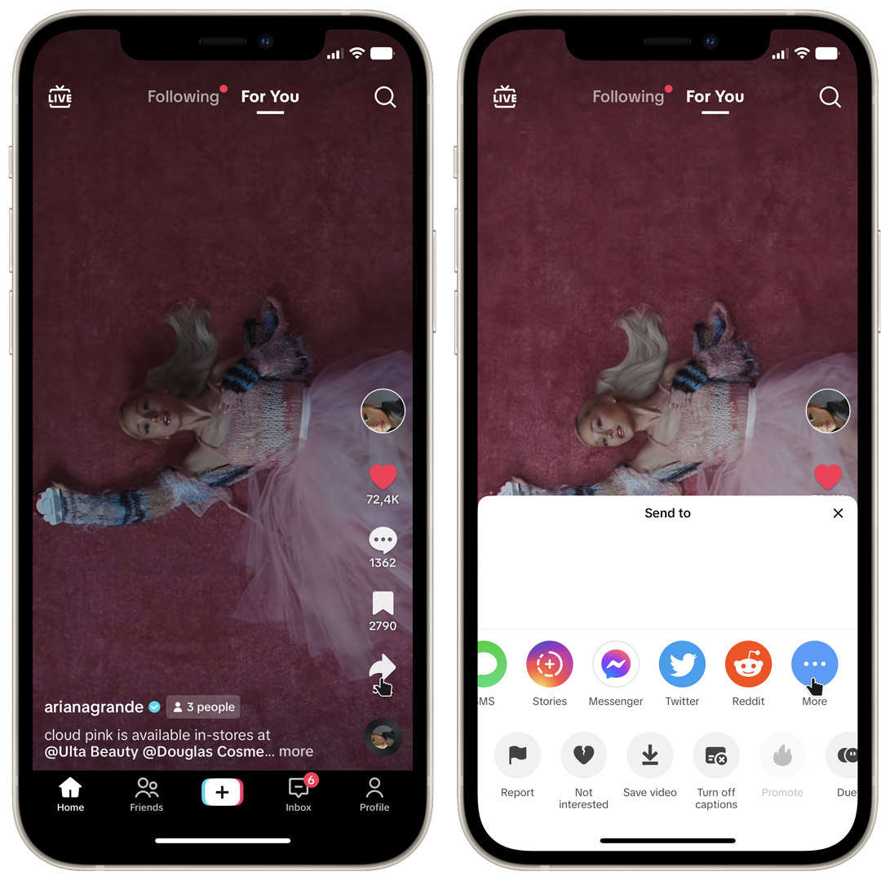
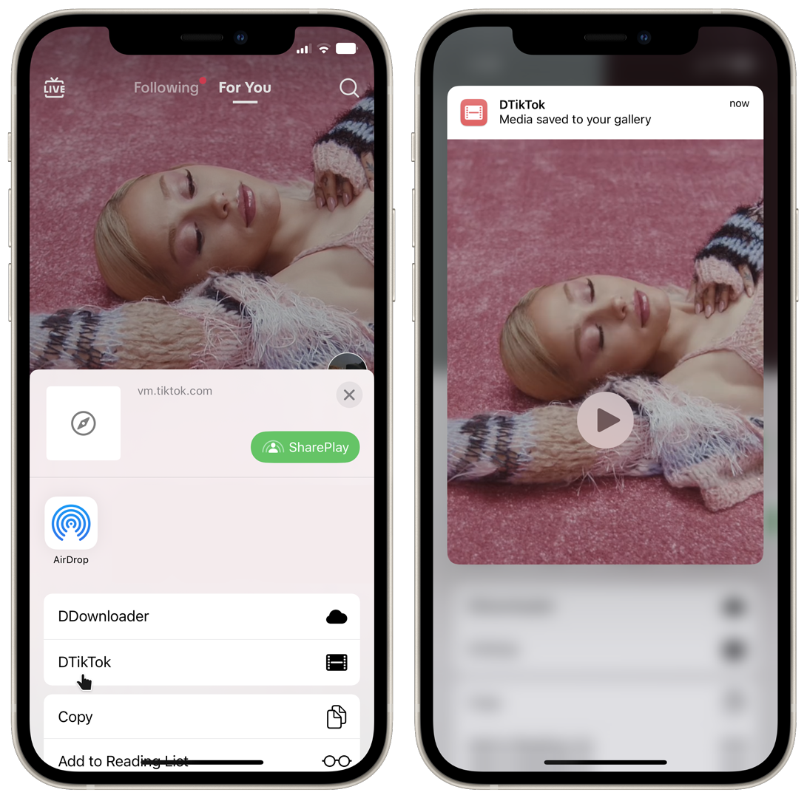

# DTikTok

## Description
A REST API to get TikTok videos without watermark. You need to get the `video_id` of the video you want to download. You can get it from the full URL of the video. This API is used in the [DTikTok Siri Shortcut](https://routinehub.co/shortcut/5870/).
and can also be used on the [web app](https://dtiktok.heismauri.com).

## Images
### Shortcut

  

  

### Web App

  

## Contributing
If you want to contribute to this project, you can open an issue or a pull request. I will be more than happy to review them.
